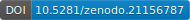

# 🦷 React Odontogram Modul

[](https://github.com/ZoliQua/React-Odontogram-Modul/releases)
[](https://github.com/ZoliQua/React-Odontogram-Modul)
[](https://github.com/ZoliQua/React-Odontogram-Modul/blob/main/LICENSE)
[](https://doi.org/10.5281/zenodo.21156787)

[](https://reactjs.org/)
[](https://www.typescriptlang.org/)

---

> 🌐 **Languages:**  🇬🇧 [English](../README.md#-english) | 🇪🇸 [Español](../README.md#-español) | 🇩🇪 [Deutsch](README-de.md) | 🇭🇺 [Magyar](README-hu.md) | 🇮🇹 [Italiano](README-it.md) | 🇸🇰 [Slovenčina](README-sk.md) | 🇵🇱 [Polski](README-pl.md) | 🇷🇺 [Русский](README-ru.md) | 🇧🇷 [Português (BR)](README-pt-br.md)

---

## 🇸🇰 Slovenčina

### 📋 Prehľad
Tento projekt je interaktívny, prehliadačovo orientovaný editor odontogramu, ktorý umožňuje rýchle zaznamenávanie zubného statusu s prehľadným rozhraním. Vykresľuje vrstvené SVG šablóny zubov na reprezentáciu reštaurácií, kazu, endodontického stavu, mobility a ďalších klinických detailov, pričom poskytuje viacnásobný výber, filtre výberu a preddefinované stavové predvoľby.

---


🔗 **Test URL:** https://react-odontogram-modul.vercel.app/

---

### ✨ Kľúčové funkcie
- 🖱️ Rýchly výber a viacnásobný výber (CMD/CTRL + klik)
- 🦷 Typy zubov: trvalý, mliečny, implantát, subgingiválny, chýbajúci
- 👑 Materiály korunky: prirodzená (plná korunka), zlomená, preparovaná na korunku, radix, e.max, zirkón, kovovo-keramická, dočasná, teleskopická
- 🔩 Implantátové abutmenty: hojivý abutment, lokátor, lokátor s protézou, steg, steg s protézou
- 🌉 Mostové členy: zirkón, kov, dočasný, snímateľný, steg, steg s protézou
- 🔍 Zaznamenávanie kazu na 6 plochách: meziálne, distálne, bukálne, linguálne, oklúzne, subkoronálne
- 🪥 Materiály výplní na každú plochu: amalgám, kompozit, GIC, dočasný
- 🏥 Endodontické stavy: liečivá výplň, koreňová výplň, nekompletná koreňová výplň, sklený kolík, kovový kolík, resekcia, parapulpálny kolík
- ⚕️ Modifikácie: periapikálny zápal (vnútri/vonku), parodontálne ochorenie, stupne mobility (M1/M2/M3)
- 🏷️ Špeciálne indikátory: potrebná korunka, potrebná výmena korunky, uzavretá medzera, plán extrakcie, bruxistické opotrebenie/cervikálne opotrebenie, zapečatenie fisúr, strata kontaktného bodu
- 👁️ Oklúzny pohľad, zuby múdrosti, prepínače viditeľnosti kosti a drene
- 🔢 12 filtrov výberu (všetky, prítomné, trvalé, mliečne, implantáty, chýbajúce, horné/dolné, predné/moláre)
- 📊 Preddefinované stavové predvoľby (obnoviť, mliečny chrup, zmiešaný chrup, bezzubý)
- 📦 34 preddefinovaných šablón reštaurácií (mostíky, snímateľné protézy, stegové protézy s implantátmi)
- 💾 Export/import stavu v JSON (verzia 1.3, s vlastnými stavmi pluginov a poznámkami ku každému zubu)
- 🔗 Export HL7 FHIR R4 (kolekcia Bundle s Observations pre každý zub, kódovanie zubov ISO 3950 pre trvalý chrup, lokálny systém kódov — mapovanie SNOMED CT plánované)
- ✚ Krížový výber plôch (B/M/O/D/L) pre kaz a výplne
- 🧱 Materiály reštaurácie pre každú plochu (zmiešané výplne, napr. bukálny amalgám + distálny kompozit)
- 🖼️ Export obrázka odontogramu vo formáte PNG/JPG/SVG (na stiahnutie; PNG/JPG rastrovaný z vektorového SVG)
- 🦷 Sekundárny (rekurentný) kaz — automaticky odvodený, keď sa kaz prekrýva s výplňou
- 🪨 Zubný kameň, resorpcia koreňa a typizované periapikálne lézie (granulóm / cysta / absces)
- 📏 Hĺbka kazu na každú plochu (povrchový / dentín / hlboký), alebo voliteľné skórovanie ICDAS II (0–6) cez `enableIcdas`
- 🧰 Zjednotená lišta ikon v hornej časti s ponukou Nastavenia (číslovanie, poznámky, ICDAS, informácie o zuboch)
- 📋 Panel informácií o zuboch: živý textový súhrn celého odontogramu (počty zubov, zoznamy prítomných/chýbajúcich, kaz vrátane sekundárneho, výplne, koreňové kanáliky, protetika, implantáty, stav parodontu) — zobrazený predvolene, prepínateľný v Nastaveniach
- 🗂️ Konsolidovaný rozbaľovací zoznam Exportu (Stav JSON / FHIR / PNG / JPG)
- 📥 Rozbaľovací zoznam Importu s importom FHIR (spätne načítava exportované Bundles)
- ⏳ Prekrytie priebehom počas exportu obrázka
- 🎓 12-krokový interaktívny úvodný sprievodca
- 🔢 Tri systémy číslovania (FDI, Universal, Palmer)
- 🌐 I18n (HU/EN/DE/ES/IT/SK/PL/RU/PT-BR) s prepínačom jazyka (190+ prekladových kľúčov na jazyk)
- 🌗 Podpora tmavého režimu s prepínacím tlačidlom (samostatný alebo riadený nadradenou aplikáciou)
- 🎨 Vlastná konfigurácia témy (prop `themeConfig`) s CSS vlastnými vlastnosťami (`--odon-*`)
- 📱 Mobilné dotykové UX: vyskakovacie okno pre priblíženie kliknutím, kontextová ponuka dlhým stlačením, priblíženie štipnutím, WCAG 44px dotykové ciele, navigácia prepínania oblúka
- 🔌 Vlastný SVG systém pluginov: vkladanie vizuálnych prekrytí, vlastný stav pre každý zub, podpora exportu/importu JSON
- ⚠️ Varovania validácie stavu pre nekompatibilné kombinácie zubných stavov
- 🏷️ Automatický tooltip stavu na dlaždiciach zubov (zobrazuje všetky aktívne stavy)
- ♿ Klávesnicová prístupnosť (WCAG): ARIA role listbox/option, výber klávesmi Enter/Medzera, navigácia šípkami, obrysy focus-visible
- 🔒 Režim iba na čítanie: zakázanie všetkých interakcií pre prípady tlače/správ/prezerania
- ✨ Animácie výberu: pulzujúci prerušovaný okraj a žiariaci tieň na vybraných zuboch (s podporou prefers-reduced-motion)
- 📝 Poznámky ku každému zubu: dvojklik pre pridanie/úpravu poznámok, ikona poznámky vedľa čísla zuba, tooltip pri najetí s textom poznámky, export/import JSON
- 🧪 202 automatizovaných testov (Vitest) v 16 testovacích súboroch pokrývajúcich číslovanie, preklady, predvoľby, i18n, komponent App, tému, dotyk, pluginy a prístupnosť
- 📖 Dokumentácia API TypeDoc s komentármi JSDoc pre všetky verejné exporty (`npm run docs`)

### 📦 Moduly
- 🦷 Mriežka odontogramu a rozhranie dlaždíc zubov
- 🎛️ Ovládacie prvky a stavový panel
- 🎨 SVG vrstevnací modul a šablóny
- 🔢 Číslovanie zubov a mapovanie popiskov (FDI/Universal/Palmer)
- 🌐 Lokalizácia (HU/EN/DE/ES/IT/SK/PL/RU/PT-BR)
- 💾 Export/import stavu
- 📋 Doplnky stavu: preddefinované šablóny reštaurácií
- 🎨 Konfigurácia témy: prispôsobiteľná farebná paleta cez CSS vlastnosti `--odon-*`
- 📱 Mobilné dotykové interakcie (priblíženie kliknutím, dlhé stlačenie, priblíženie štipnutím, prepínanie oblúka)
- 🔌 Vlastný SVG systém pluginov
- ⚠️ Systém validácie stavu a tooltipov
- ♿ Klávesnicová prístupnosť a podpora ARIA
- 🔒 Režim iba na čítanie
- ✨ Animácie výberu
- 📝 Systém poznámok ku každému zubu
- 🧪 Automatizovaná testovacia sada (Vitest + Testing Library)

### 🛠️ Ovládacie prvky rozhrania

**🔝 Horná lišta:**
- Prepínač jazyka (rozbaľovací zoznam HU/EN/DE/ES/IT/SK/PL/RU/PT-BR)
- Prepínacie tlačidlo tmavého režimu (ikona slnka/mesiaca, prepína medzi svetlou a tmavou témou)
- Prepínač systému číslovania (rozbaľovací zoznam FDI/Universal/Palmer)
- Tlačidlá Exportovať stav / Importovať stav

**📊 Hlavička grafu:**
- Prepínač oklúzneho pohľadu
- Prepínač viditeľnosti zubov múdrosti
- Prepínač viditeľnosti kosti
- Prepínač viditeľnosti drene
- Tlačidlo zrušiť výber

**🔍 Filtre výberu:**
- Vybrať všetky / Všetky prítomné / Trvalé / Mliečne / Implantáty / Všetky chýbajúce
- Vybrať horné / Horné 6 predných / Horné moláre
- Vybrať dolné / Dolné 6 predných / Dolné moláre

**📋 Stavové predvoľby:**
- Obnoviť všetko (obnoviť ústa)
- Mliečny chrup
- Zmiešaný chrup
- Prepínač bezzubého

**📦 Rozbaľovací zoznam doplnkov stavu:**
- Horné/dolné zirkónové mostíky (12-22, 13-23, 16-26, celý oblúk)
- Horné/dolné kovovo-keramické mostíky (12-22, 13-23, 16-26, celý oblúk)
- Horné/dolné čiastočné snímateľné protézy
- Horné/dolné celkové snímateľné protézy
- Horné/dolné stegové protézy s implantátmi

### 🦷 Typy a stavy zubov

**Výber zuba (základný typ):**
| Hodnota | Popis |
|---|---|
| `none` | Chýbajúci zub |
| `tooth-base` | Trvalý zub |
| `milktooth` | Mliečny (dočasný) zub |
| `implant` | Dentálny implantát |
| `tooth-under-gum` | Subgingiválny (nevyrastený) zub |

**Varianty zlomeného zuba:**
`tooth-broken-inicisal`, `tooth-broken-distal-inicisal`, `tooth-broken-distal`, `tooth-broken-mesial-distal-inicisal`, `tooth-broken-mesial-distal`, `tooth-broken-mesial-inicisal`, `tooth-broken-mesial`, `no-tooth-after-extraction`

**Materiály korunky (trvalé zuby):**
`radix`, `natural` (plná korunka, predvolené), `broken`, `crownprep` (preparovaná na korunku), `emax`, `zircon`, `metal`, `temporary`, `telescope`

**Materiály korunky (implantáty):**
`natural` (žiadna), `healing-abutment`, `zircon`, `metal`, `temporary`, `locator`, `locator-prosthesis`, `bar`, `bar-prosthesis`

**Mostové členy:**
`none`, `removable`, `zircon`, `metal`, `temporary`, `bar`, `bar-prosthesis`

**Endodontické možnosti (trvalé zuby):**
`none`, `endo-medical-filling`, `endo-filling`, `endo-filling-incomplete`, `endo-glass-pin`, `endo-metal-pin`

**Endodontické možnosti (mliečne zuby):**
`none`, `endo-medical-filling`

**Materiály výplní (trvalé zuby):**
`amalgam`, `composite`, `gic`, `temporary`

**Materiály výplní (mliečne zuby):**
`composite`, `gic`, `temporary`

**Plochy výplní/kazu:**
`mesial`, `distal`, `buccal`, `lingual`, `occlusal`, `subcrown` (iba kaz)

**Modifikácie:**
`inflammation` (periapikálny), `parodontal` (parodontálny), `mobility` (M1/M2/M3)

**Typ periapikálnej lézie** (upresňuje `inflammation`):
`none`, `granuloma`, `cyst`, `abscess`

**Hĺbka kazu** (na plochu): `superficial` / `dentin` / `deep`, alebo voliteľné kódy ICDAS II `0–6` pri nastavení `enableIcdas`

**Špeciálne indikátory:**
`crownNeeded`, `crownReplace`, `missingClosed`, `extractionPlan`, `extractionWound`, `bridgePillar`, `fissureSealing`, `contactMesial`, `contactDistal`, `bruxismWear`, `bruxismNeckWear`, `pulpInflam`, `endoResection`, `rootResorption`, `calculus`, `parapulpalPin`

### 🖼️ Systém SVG šablón

**Šablóny zubov** (v `src/assets/teeth-svgs/`):
| Šablóna | Zuby, ktoré ju používajú |
|---|---|
| `11.svg` | 11, 12, 21, 22, 31, 32, 41, 42 (rezáky) |
| `13.svg` | 13, 23, 33, 43 (špičáky) |
| `14.svg` / `14_occl.svg` | 14, 15, 24, 25, 34, 35, 44, 45 (premoláre) |
| `16.svg` / `16_occl.svg` | 16, 17, 18, 26, 27, 28, 36, 37, 38, 46, 47, 48 (moláre) |

Šablóny sú pre dolnú čeľusť otočené o 180 stupňov a pre ľavú stranu horizontálne zrkadlové.

**Ikony SVG** (v `src/assets/icon-svgs/`):
`icon_8.svg` (múdrosť), `icon_gum.svg` (kosť), `icon_no_selection.svg` (zrušiť), `icon_occl.svg` (oklúzny pohľad), `icon_pulp.svg` (dreň)

### 🔢 Systémy číslovania

**FDI (ISO 3950):** Trvalé zuby 11-18, 21-28, 31-38, 41-48. Mliečne zuby 51-55, 61-65, 71-75, 81-85.

**Universal (USA):** Trvalé zuby číslované 1-32. Mliečne zuby označené písmenami A-T.

**Palmer (Zsigmondy-Palmer):** Formát kvadrant + pozícia (napr. UR-1, LL-5). Mliečne zuby používajú písmená A-E na kvadrant.

### 🚀 Použitie
Vývoj:
```bash
npm install
npm run dev
```
Zostavenie:
```bash
npm run build
```
Náhľad:
```bash
npm run preview
```

### 🔗 Integrácia
Komponent je možné vložiť do ľubovoľnej React aplikácie.
Príklad:
```tsx
import App from "./App";

export default function Host(){
  return (
    <App
      language="sk"
      onLanguageChange={(lang) => console.log(lang)}
      numberingSystem="FDI"
      onNumberingChange={(system) => console.log(system)}
      darkMode={false}
      onDarkModeChange={(dark) => console.log(dark)}
    />
  );
}
```

**Integrácia tmavého režimu:**
- **Samostatný režim:** Vynechajte prop `darkMode` — komponent spravuje vlastný stav témy cez prepínacie tlačidlo v hornej lište a pridáva/odstraňuje triedu `.dark` na `<html>`.
- **Riadený režim:** Odovzdajte `darkMode` a `onDarkModeChange` — nadradená aplikácia riadi tému. Prepínacie tlačidlo sa stále zobrazuje, ale volá `onDarkModeChange` namiesto správy interného stavu. Nadradená aplikácia je zodpovedná za pridávanie/odstraňovanie triedy `.dark` na `<html>`.

**Vlastná téma:**
```tsx
<App
  themeConfig={{
    colors: {
      accent: '#e74c3c',
      background: '#fafafa',
      text: '#222222',
    },
  }}
/>
```

**Integrácia pluginu:**
```tsx
import App, { type OdontogramPlugin, setPluginState } from "./App";

const myPlugin: OdontogramPlugin = {
  id: "implant-brand",
  label: { en: "Implant Brand", hu: "Implantátum márka" },
  layer: "overlay",
  renderSvg: (toothNo, _quadrant, state) => {
    if (!state) return null;
    return `<text x="16" y="60" font-size="6" fill="#3b7bff">${state}</text>`;
  },
};

<App plugins={[myPlugin]} />

// Set plugin state for a tooth:
setPluginState(11, "implant-brand", "Straumann");
```

### 🧪 Testovanie
```bash
npm run test           # Spustiť všetkých 202 testov
npm run test:watch     # Sledovací režim
npm run test:coverage  # Správa pokrytia
```

### 📖 Dokumentácia API
```bash
npm run docs           # Generovať dokumentáciu TypeDoc v docs/
```

### 📡 Verejné API

**Props komponentu:**

| Prop | Typ | Predvolené | Popis |
|---|---|---|---|
| `language` | `string` | `'hu'` | Jazyk rozhrania (hu/en/de/es/it/sk/pl/ru/pt-br) |
| `onLanguageChange` | `(lang) => void` | — | Spätné volanie pri zmene jazyka |
| `numberingSystem` | `string` | `'FDI'` | Systém číslovania (FDI/Universal/Palmer) |
| `onNumberingChange` | `(system) => void` | — | Spätné volanie pri zmene číslovania |
| `darkMode` | `boolean` | `undefined` | Stav tmavého režimu. Vynechajte pre samostatný režim. |
| `onDarkModeChange` | `(dark) => void` | — | Spätné volanie pri prepnutí tmavého režimu. Vyžadované pre riadený režim. |
| `themeConfig` | `OdontogramThemeConfig` | `undefined` | Vlastné prepísanie farieb cez CSS vlastné vlastnosti (`--odon-*`). |
| `plugins` | `OdontogramPlugin[]` | `undefined` | Vlastné SVG pluginy pre vizuálne prekrytia a vlastný stav každého zuba. |
| `readOnly` | `boolean` | `undefined` | Zakázanie všetkých interakcií (klik, dotyk, klávesnica). Užitočné pre zobrazenia tlače/správ. |
| `enableNotes` | `boolean` | `undefined` | Povolenie poznámok ku každému zubu. Dvojklik na zub pre pridanie/úpravu poznámok. |

**Exportované funkcie pre externú kontrolu:**

| Funkcia | Popis |
|---|---|
| `initOdontogram()` | Inicializovať modul a vykresliť všetky zuby |
| `destroyOdontogram()` | Vyčistiť modul a odstrániť poslucháčov udalostí |
| `setNumberingSystem(system)` | Prepínanie medzi FDI, Universal, Palmer |
| `clearSelection()` | Zrušiť výber všetkých zubov |
| `setOcclusalVisible(on)` | Prepínanie oklúzneho pohľadu zap/vyp |
| `setWisdomVisible(on)` | Zobraziť/skryť zuby múdrosti |
| `setShowBase(on)` | Zobraziť/skryť vrstvu kosti |
| `setHealthyPulpVisible(on)` | Zobraziť/skryť zdravú dreň |
| `registerPlugins(plugins)` | Registrovať vlastné SVG pluginy |
| `setPluginState(toothNo, pluginId, value)` | Nastaviť vlastný stav pluginu pre zub |
| `getPluginState(toothNo, pluginId)` | Získať vlastný stav pluginu pre zub |
| `getToothStateSummary(toothNo)` | Získať lokalizovaný súhrn všetkých aktívnych stavov |
| `getOdontogramSummary()` | Získať štruktúrovaný, lokalizovaný textový súhrn celého odontogramu (počty, sekcie) |
| `onStateChange(callback)` | Prihlásiť sa na odber zmien stavu; vracia funkciu na odhlásenie |
| `setReadOnly(value)` | Povolenie/zakázanie režimu iba na čítanie |
| `getReadOnly()` | Získať aktuálny stav iba na čítanie |
| `setNotesEnabled(value)` | Povolenie/zakázanie poznámok ku každému zubu |
| `getNotesEnabled()` | Získať aktuálny stav povolenosti poznámok |
| `exportFhir(options?)` | Export odontogramu ako kolekcia HL7 FHIR R4 Bundle (stiahnutie JSON). Voliteľná referencia `{ subject }`; inak je vložený zástupný Patient |
| `exportImage(format)` | Stiahnuť odontogram ako obrázok — `"png"` alebo `"jpg"` |
| `exportSvg()` | Stiahnuť odontogram ako škálovateľný SVG (vektor) |
| `importFhirBundle(input)` | Importovať FHIR R4 Bundle (objekt alebo reťazec JSON) produkovaný týmto modulom |
| `setImportFormat(format)` | Nastaviť analyzátor pre nasledujúci import súboru — `"status"` alebo `"fhir"` |
| `startIntroTour()` | Spustiť 12-krokový interaktívny úvodný sprievodca |

### 💾 Formát exportu/importu stavu
Export vytvorí súbor JSON (verzia `1.3`) obsahujúci:

**Globálne polia:**
- `wisdomVisible` - zuby múdrosti viditeľné
- `showBase` - vrstva kosti viditeľná
- `occlusalVisible` - oklúzny pohľad aktívny
- `showHealthyPulp` - zdravá dreň viditeľná
- `edentulous` - bezzubý režim aktívny

**Polia pre každý zub (32 zubov):**
- `toothSelection` - základný typ zuba
- `crownMaterial` - materiál korunky/abutmentu
- `bridgeUnit` - typ mosta (spájacieho člena)
- `endo` - endodontický stav
- `mods` - pole modifikácií (zápal, parodontálny)
- `caries` - aktívne plochy kazu
- `fillingMaterial` - materiál výplne
- `fillingSurfaces` - plombované plochy
- `pulpInflam` - príznak zápalu drene
- `endoResection` - príznak apikektómie
- `fissureSealing` - príznak zapečatenia fisúr
- `contactMesial` - strata meziálneho kontaktného bodu
- `contactDistal` - strata distálneho kontaktného bodu
- `bruxismWear` - oklúzne bruxistické opotrebenie
- `bruxismNeckWear` - cervikálne bruxistické opotrebenie
- `brokenMesial`, `brokenIncisal`, `brokenDistal` - miesta zlomenín
- `extractionWound` - poextrakčná rana
- `extractionPlan` - plánovaná extrakcia
- `parapulpalPin` - príznak parapulpálneho kolíka
- `bridgePillar` - pilierový zub mostíka
- `mobility` - stupeň mobility (none/m1/m2/m3)
- `crownNeeded` - indikátor potreby korunky
- `crownReplace` - indikátor potreby výmeny korunky
- `missingClosed` - uzavretá medzera po extrakcii
- `customStates` - vlastné stavy pluginov (objekt, kľúčovaný ID pluginu)
- `note` - textová poznámka ku každému zubu (reťazec, voliteľný — prítomný iba keď nie je prázdny)

### 📁 Štruktúra priečinkov
- `src/App.tsx` - rozhranie shellu, ovládacie prvky hornej lišty, prepínač jazyka/číslovania/tmavého režimu/témy/pluginu
- `src/odontogram.ts` - SVG vrstevnací modul, správa stavu zubov, dotykové interakcie, prekrytia pluginov, zapojenie rozhrania
- `src/plugin.ts` - typ `OdontogramPlugin`, `PluginLayer`, `getQuadrant()`, priority z-indexu `LAYER_Z`
- `src/theme.ts` - typ `OdontogramThemeConfig` a pomocná funkcia `applyThemeConfig()`
- `src/status_extras.ts` - 34 preddefinovaných šablón reštaurácií (mostíky, protézy, stegové konštrukcie)
- `src/i18n/` - preklady (HU/EN/DE/ES/IT/SK/PL/RU/PT-BR) a i18n hook
- `src/utils/numbering.ts` - konverzia číslovania FDI, Universal, Palmer
- `src/__tests__/` - testovacia sada Vitest (202 testov v 16 súboroch)
- `src/assets/teeth-svgs/` - SVG šablóny zubov (6 súborov: rezáky, špičáky, premoláre, moláre + oklúzne pohľady)
- `src/assets/icon-svgs/` - SVG ikony panela nástrojov (5 súborov)

### ⚙️ Technologický zásobník
- React 18 + Vite + TypeScript
- Tailwind CSS pre štýlovanie rozhrania
- Vrstvenie SVG cez manipuláciu DOM (nie React stav pre výkon)
- Ľahký vlastný systém i18n
- Vitest + Testing Library pre automatizované testy
- TypeDoc pre dokumentáciu API
- Vite alias cesty: `@` mapovaný na `./src`

### 📝 Poznámky
- SVG šablóny sa načítavajú z `src/assets/teeth-svgs` a `src/assets/icon-svgs`, takže statický hosting musí poskytovať priečinok public.
- Modul odontogramu používa vlastný interný stav (nie React stav) pre výkon a jednoduchosť.
- Mliečne zuby majú obmedzenú sadu dostupných materiálov (žiadne amalgámové výplne, žiadne endodontické kolíky).
- Implantátové zuby majú inú sadu možností korunky/abutmentu ako prirodzené zuby.

### 📖 Ako citovať

Ak tento modul použijete vo svojej práci, prosím, citujte ho.

**Táto verzia (v1.10.0):**
> Dul, Z. (2026). *React Odontogram Modul* (v1.10.0). Zenodo. https://doi.org/10.5281/zenodo.21156788

**Všetky verzie (konceptové DOI):** https://doi.org/10.5281/zenodo.21156787

Strojovo čitateľné citačné metadáta sú v súbore [`CITATION.cff`](../CITATION.cff).
